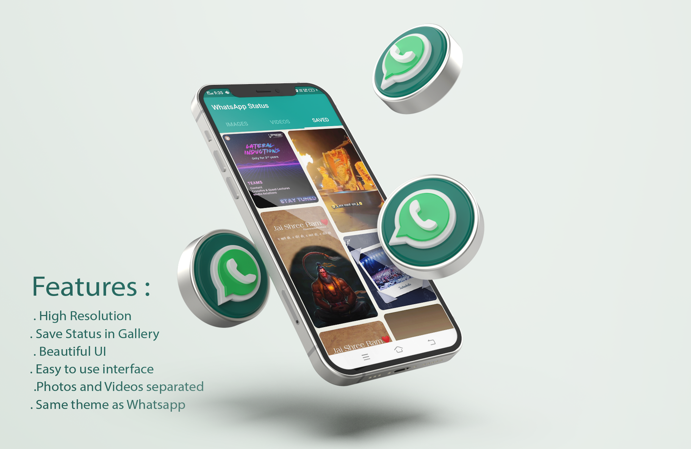
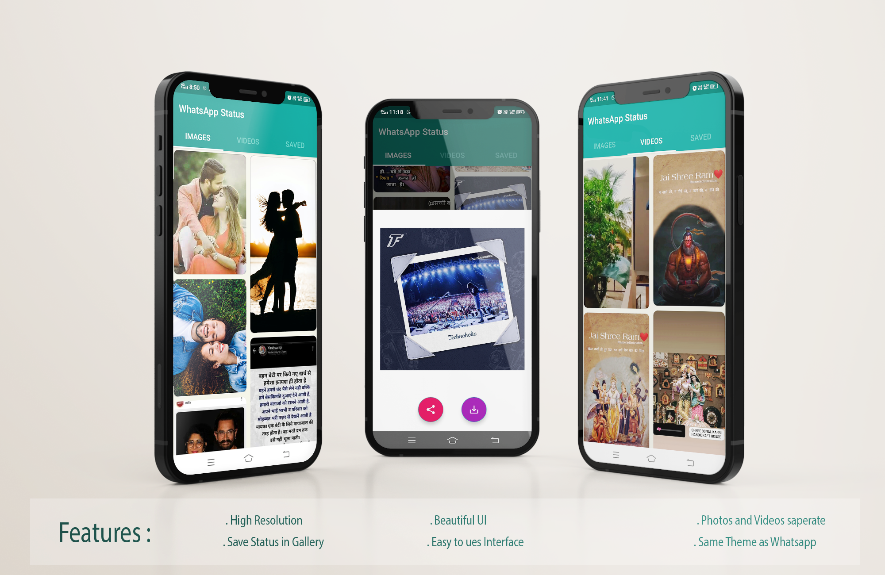
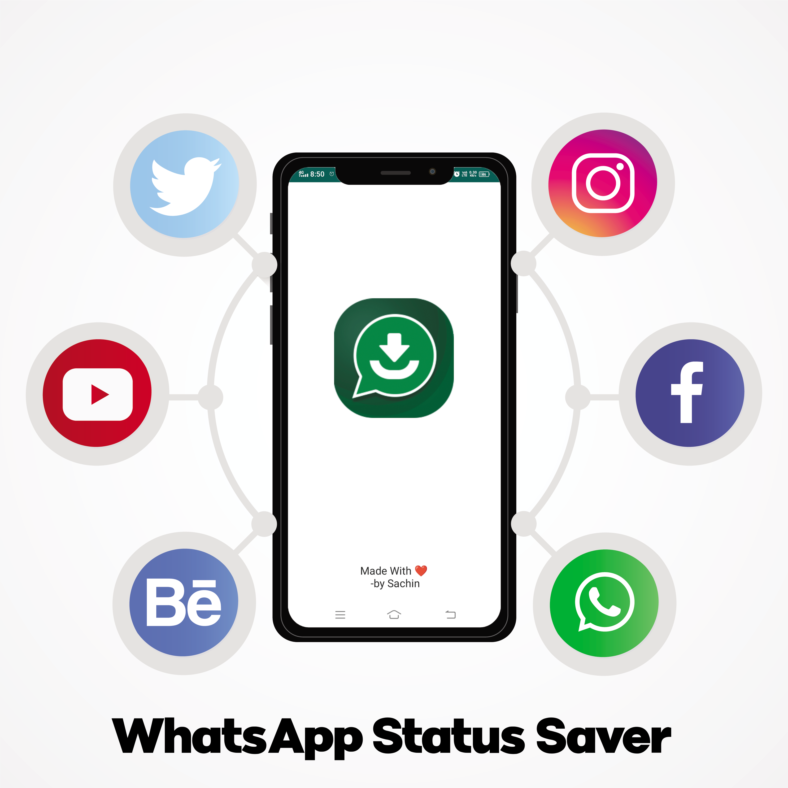

# WhatsApp-Status-Saver
Do you also Love your Friends Status?
Then this App is perfect for you. 😃

**How to Use This App?**

1 - Go to WhatsApp and See your friends Status

2 - Open App, Click on any Status to View, and Share it directly with this App

3 - If you like it, click the Save Button.

The Status gets Instantly saved to your Gallery! 😉

The App shows you Statuses from WhatsApp, With a beautiful UI 😍that allows you to navigate through the statuses easily. 

**Features:**
* Save any Whatsapp status
* Easy Share without Saving,
* Easy & Fast Saving,
* Built-in Image Viewer & Video Player,
* Easy Navigation!
* Beautiful UI
* Advertisement Free

Still, Reading this? 😛
Go get the App & start Saving Statuses! 😃
Hey wait,
Don't forget to leave your feedback and Suggestion! 😀😁

**Disclaimer:**
This App is not the Actual WhatsApp provided by Facebook. The UI has been made similar to make Users feel comfortable with this App. This App uses your internal storage to show you WhatsApp Status Images. We don't upload any of your data on our server. This App does not contain ads right now, but we will put ads in the future to keep this project running.

**Credits:**
Mockup PSD created by syifa5610 - www.freepik.com
Facebook vector created by BiZkettE1 - www.freepik.com
Links : 
https://www.freepik.com/psd/mockup
https://www.freepik.com/vectors/facebook
